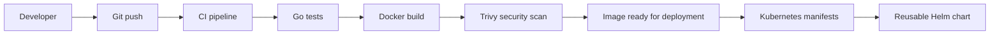

# DevOps Local Pipeline Lab

Small Go-based microservice used to demonstrate a basic DevOps workflow:
local development, Docker multi-stage build, GitLab CI validation and Kubernetes-ready service endpoints.

## Features

- HTTP service written in Go
- `/health`, `/ready` and `/version` endpoints
- Multi-stage Docker build
- Non-root container runtime
- Docker healthcheck
- GitLab CI pipeline for tests and Docker build
- Simple Makefile for local workflow

## Project structure

```text
devops-local-pipeline-lab/
├── cmd/server/
│   ├── main.go
│   └── main_test.go
├── Dockerfile
├── .dockerignore
├── .gitlab-ci.yml
├── Makefile
├── go.mod
└── README.md
```

## Current project status

The lab currently demonstrates a reusable microservice delivery workflow:

- Go HTTP service with `/`, `/health`, `/ready` and `/version` endpoints
- Go unit test using `httptest`
- Multi-stage Docker build
- Non-root container runtime
- Docker healthcheck
- Local developer workflow via Makefile
- GitHub Actions CI validation
- GitLab CI validation
- Kubernetes Deployment and Service manifests
- Reusable Helm chart template
- Helm chart lint and template rendering in CI

Current validated flow:

```text
code
  -> go test
  -> docker build
  -> Kubernetes manifest definition
  -> Helm lint
  -> Helm template render


## Run locally

```bash
go run ./cmd/server
```

## Test locally

```bash
go test ./...
```

## Build Docker image

```bash
docker build -t devops-local-pipeline-lab:1.0.0 .
```

## Run Docker container

```bash
docker run --rm -p 8080:8080 devops-local-pipeline-lab:1.0.0
```

## Run Docker container in detached mode

```bash
docker run -d --name devops-lab -p 8080:8080 devops-local-pipeline-lab:1.0.0
```

## Test endpoints

```bash
curl http://localhost:8080/
curl http://localhost:8080/health
curl http://localhost:8080/ready
curl http://localhost:8080/version
```

## Stop detached container

```bash
docker stop devops-lab
docker rm devops-lab
```

## Makefile commands

```bash
make test
make run
make docker-build
make docker-run
make docker-run-detached
make docker-stop
```

## GitLab CI

The included `.gitlab-ci.yml` validates the application by running Go tests and building the Docker image.

Pipeline stages:

1. `test`
2. `docker-build`


## DevOps purpose

This project demonstrates a simple production-style service lifecycle:

1. Application code
2. Local tests
3. Multi-stage container build
4. Health and readiness endpoints
5. Docker healthcheck
6. CI pipeline validation
7. Foundation for future Kubernetes deployment


## CI/CD

This project includes two CI examples:

- GitHub Actions workflow in `.github/workflows/ci.yml`
- GitLab CI pipeline in `.gitlab-ci.yml`

Both pipelines validate the service by running Go tests and building the Docker image.

## Architecture and delivery flow



This lab demonstrates a basic reusable microservice delivery workflow:

1. Developer pushes code.
2. CI runs Go tests.
3. CI builds the Docker image.
4. Trivy scans the image for vulnerabilities.
5. Kubernetes manifests define how the service runs.
6. Helm turns the manifests into a reusable deployment template.


```md
## Kubernetes and Helm

Static Kubernetes manifests are available under:

```text
k8s/
├── deployment.yaml
└── service.yaml

charts/microservice/
├── Chart.yaml
├── values.yaml
└── templates/

- Trivy image scanning in GitHub Actions and GitLab CI
- Security scan currently runs in report-only mode using `--exit-code 0`
